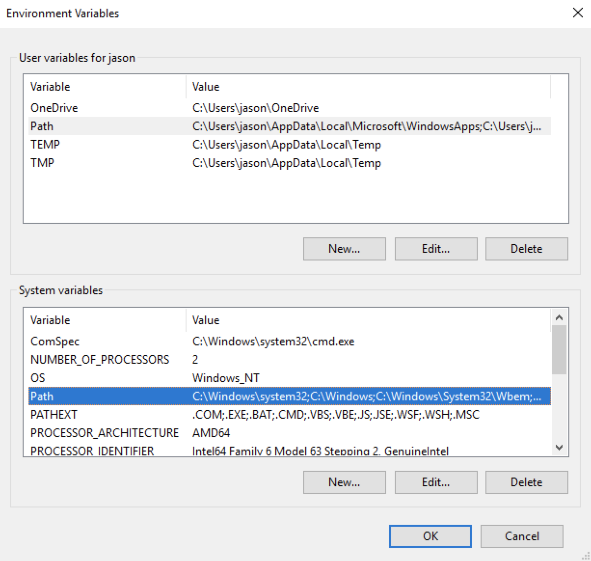

[La version française suit.](#---------------------------------------------------------------------)

# NRCAN's Energuide API

CircleCI Status: [](https://circleci.com/gh/cds-snc/nrcan_api)

This is the API for NRCAN's Energuide data.

This project is composed of two parts: the API itself and the ETL process that produces the data the API will serve.
There are further details in the READMEs for each of the respective portions of the project.

- [Windows Installation Instructions](#windows-installation-and-setup)
- [MacOS Installation Instructions](#tldr)

You can also explore the live API using [GraphiQL](http://energuideapi.ca/graphiql).

## Quickstart

### TL;DR

If you're really keen (and on a Mac), this should do you. Or continue reading for more details.

```sh
# install python 3 and mongo
./bootstrap.sh

# import data
make setup

# export Apollo Engine API Key
export NRCAN_ENGINE_API_KEY=your_api_key

# boot up API
make run
```

### bootstrap.sh

The [bootstrap.sh](bootstrap.sh) file is a quick way to get up-and-running on a macOS environment. It relies on [Homebrew](https://brew.sh/) to install both Python 3 (using [pyenv](https://github.com/pyenv/pyenv#homebrew-on-mac-os-x)) and [MongoDB](https://docs.mongodb.com/manual/tutorial/install-mongodb-on-os-x/#install-mongodb-community-edition-with-homebrew).

To get started, run

```
./bootstrap.sh
```

*Note that to get pyenv running by default in your preferred shell, you'll need to add `eval "$(pyenv init -)"` to your `~/.bash_profile` or `~/.zshrc` or after installing pyenv.*

Once the script runs through, you'll need to import the data into your database, and then boot up the API that connects to it.

#### importing data

The Python code in `/nrcan_etl` transforms the data from the default formatting set by NRCAN, and then inserts it into our Mongo database. More details can be found in the [README](https://github.com/cds-snc/nrcan_api/blob/master/nrcan_etl/README.md).

For local development, run
```
make setup
```
This will
- install the needed Python dependencies
- drop your current test data (if you have any)
- import fresh test data

Now that we have data, it's time to boot up the API.

#### running the API

##### Getting an Apollo Engine API Key

Apollo Engine is a monitoring/logging layer that gives us out-of-the-box diagnostic information about our graphql instance. You'll need your own API key to get the API running, so [sign up for one here](https://engine.apollographql.com/login).

Once you have one, you'll need to
```
export NRCAN_ENGINE_API_KEY=your_api_key
```


##### booting up the API

The JavaScript code in `/api` builds us a [GraphQL](http://graphql.org/learn/) API which allows us to query NRCAN data from the Mongo database. More info in the [README](https://github.com/cds-snc/nrcan_api/blob/master/api/README.md).

To build the app and connect it to mongo, run
```
make watch
```

This will
- install the needed JavaScript dependencies
- build the app
- serve it up locally
- rebuild when files are changed

## Windows installation and setup

### Install required software

1. Download and install Python from [here](https://www.python.org/downloads/release/python-364/).
Version 3.6.4 or higher is required.

2. Download current version of mongoDB community server from [here](https://www.mongodb.com/download-center#community).

3. Download Node.js from [here](https://nodejs.org/en/download/). Version >=8.x of Node is required.

Check if the libraries are accessible by running the following commands in a terminal window
```sh
python --version

mongo --version

node --version
```
If version is not shown, the path to the library has to be added to the 'PATH' environment variable in System Properties.

NOTE: If you're having problems, make sure that you are not adding the library to a different user's 'PATH' (such as the user path of the local admin). The library can be added to the System 'PATH' variable so that it is visible to all users on the machine.
<br>


### Clone the repo

To work with the system, a copy will need to be cloned to the developers local machine using `git`, there are many different git clients that can be used, but for simplicity sake we recommend [Git for Windows](https://git-scm.com/download/win).

Copy the repository link, and use it in the following command:
```sh
git clone <<repository link>>
```

Once the repository has been downloded, change directories into the folder created (`cd nrcan_api`).

### MongoDB Local Setup

`Mongodb` must be started before going to the next step. Open new terminal window and run the follow commands from your root directory:
```sh
# this directory is required when running mongod for the first time
md data\db
mongod
```
This window needs to remain open (it is running the database), but can be minimized as it will no longer be used.

In a new terminal window run the following command drop existing `energuide mongodb` test data, if any exists.
```
mongo energuide --eval "db.dwellings.drop()"
```

### Setup ETL environment

Installing Python applications in a `virtualenv` is considered best practice. To do so, navigate to the cloned git repository and run the following:
```sh
cd nrcan_etl
python -m venv env
env\Scripts\activate.bat
pip install -r requirements.txt
pip install -e .
```
*Note: "." is part of the command*


### Run python extractor


Run the following commands:
```sh
# extract from csv to zip file
energuide extract --infile tests/scrubbed_random_sample_xml.csv --outfile allthedata.zip

# load data into mongodb
energuide load --filename allthedata.zip

# delete zip file
del allthedata.zip
```
Unit tests for the python code.
```sh
pytest tests
mypy src tests
```

#### Using the mongodb command-line client
We can verify the data has actually been imported by using the mongodb command-line client. [More detailed docs exist](https://docs.mongodb.com/manual/reference/mongo-shell/), but these should get you going.

Run following command to connect to `energuide`db:
```sh
#open db client
mongo

# show available databases ('energuide' should exist)
show dbs

# set energuide as the default 'db'
use energuide

# get the count of entries in 'dwellings' (should be 7)
db.dwellings.count()

# select 'forwardSortationArea' value of each dwelling
db.dwellings.find({}, {'forwardSortationArea': 1})

# result should look like:
{ "_id" : ObjectId("5a848002e349de06d4bc8205"), "forwardSortationArea" : "T0J" }
{ "_id" : ObjectId("5a848002e349de06d4bc8206"), "forwardSortationArea" : "A2H" }
{ "_id" : ObjectId("5a848002e349de06d4bc8207"), "forwardSortationArea" : "Y1A" }
{ "_id" : ObjectId("5a848002e349de06d4bc8208"), "forwardSortationArea" : "G1A" }
{ "_id" : ObjectId("5a848002e349de06d4bc8209"), "forwardSortationArea" : "B2R" }
{ "_id" : ObjectId("5a848002e349de06d4bc820a"), "forwardSortationArea" : "X0A" }
{ "_id" : ObjectId("5a848002e349de06d4bc820b"), "forwardSortationArea" : "C1A" }

# disconnect from mongodb
quit()
```

### Run `GraphQL API`

Move to `nrcan_api\api` folder.

`API` utilizes Apollo Engine to monitor activities on host with `GraphQL` website.
Apollo Engine is a monitoring/logging layer that gives us out-of-the-box diagnostic information about our graphql instance. You'll need your own API key to get the API running, so [sign up for one here](https://engine.apollographql.com/login).
Key looks similar to: `service:yname-8241:lQ3g_8Yojs4stdIWqwwj-bQ`

Set following variables:
```sh
set NRCAN_DB_CONNECTION_STRING=mongodb://localhost:27017
set NRCAN_DB_NAME=energuide
set NRCAN_COLLECTION_NAME=dwellings
set NRCAN_ENGINE_API_KEY=service:yname-8241:lQ3g_8Yojs4stdIWqwwj-bQ
```

Make sure `yarn` is installed

```sh
# should return a version number
yarn --version
```
If `yarn` is not installed, run `npm install --global yarn` to install.

Next command start `GraphQL`
```sh
yarn build && yarn start
```

### Using the API locally

The API should be running now! Yes!! 🎉🎉🎉

Check it out at [http://localhost:3000/graphiql](http://localhost:3000/graphiql)

Try out this query to get you going.

```
{
  dwellings(
    filters: [
      {field: dwellingForwardSortationArea comparator: eq value: "C1A"}
    ]
  ) {
    results {
      yearBuilt
      city
    }
  }
}
```

<sup>Or just [click here](http://localhost:3000/graphiql?query=%7B%0A%20%20dwellings(%0A%20%20%20%20filters%3A%20%5B%0A%20%20%20%20%20%20%7Bfield%3A%20dwellingForwardSortationArea%20comparator%3A%20eq%20value%3A%20%22C1A%22%7D%0A%20%20%20%20%5D%0A%20%20)%20%7B%0A%20%20%20%20results%20%7B%0A%20%20%20%20%20%20yearBuilt%0A%20%20%20%20%20%20city%0A%20%20%20%20%7D%0A%20%20%7D%0A%7D)</sup>

## ---------------------------------------------------------------------

# L'API de l’ÉnerGuide de RNCan 

Le statut de CircleCI : 

C’est l’API pour les données de l’ÉnerGuide de RNCan.

Ce projet est composé de deux parties : l’API et le processus d’ETC qui produit les données que l’API servira. Il y a bien d’autres détails dans les README pour chacune des parties respectives du projet.

* [Instructions d'installation de Windows](#installation-et-configuration-de-windows)
* [Instructions d'installation de MacOS](#trop-long-pas-lu)

## Démarrez rapidement

### Trop long; pas lu

Si vous êtes vraiment intéressé (et sur un Mac), ceci devrait vous satisfaire. Ou continuez à lire pour avoir plus de détails.
```
# installez python 3 et mongo
./bootstrap.sh
 
# importez les données 
make setup
 
# exportez la clé de l’API d’Apollo Engine
export NRCAN_ENGINE_API_KEY=your_api_key
 
# Initialisez l’API
make run
```

### bootstrap.sh

Le fichier bootstrap.sh est un moyen rapide d’être opérationnel sur un environnement MacOS. Il s’appuie sur Homebrew pour installer Python 3 (en utilisant pyenv) et MongoDB.

Pour commencer, veuillez exécuter :
```
./bootstrap.sh
```
Veuillez noter que pour avoir pyenv qui fonctionne par défaut dans votre outil « shell » préféré, vous aurez besoin d’ajouter eval "$(pyenv init -)" à votre ~/.bash_profile ou ~/.zshrc après l’installation de pyenv.

Une fois que le script fonctionne, vous aurez besoin d’importer les données dans votre base de données, et ensuite d’initialiser l’API qui y est relié.

## Importation de données 

Le code Python dans /nrcan_etl transforme les données du formatage par défaut établies par RNCan, et ensuite les inserts dans nos bases de données Mongo. De plus amples détails se trouvent sur le site Web README.

Pour le développement local, veuillez exécuter : 

make setup

Ceci fera ce qui suit :

* Installer les dépendances de Python nécessaires
* Déposer vos données de test actuelles (si vous en avez)
* Importer les données de test récentes 

Maintenant que vous avez les données, c’est le moment d’initialiser l’API.

## Exécution de l’API

Obtenir une clé pour l’API d’Apollo Engine 

Apollo Engine est une couche de surveillance et d’enregistrement qui nous donne un renseignement diagnostique original sur notre exemple de graphql. Vous aurez besoin d’avoir votre propre clé de l’API pour exécuter l’API, donc vous pouvez vous [inscrire ici pour en avoir une](https://engine.apollographql.com/login).

Une fois que vous en avez une, vous aurez besoin de faire ceci : 
```
export NRCAN_ENGINE_API_KEY=your_api_key
```

Initialisation de l’API

Le code JavaScript dans /api élabore pour nous un API de GraphQL qui nous permet d'interroger les données de RNCan de mongodb. De plus amples renseignements se trouvent sur le site Web [README](https://github.com/cds-snc/nrcan_api/blob/master/api/README.md).

Pour créer l'application et le connecter à Mongo, exécutez :
```
make watch
```
Ceci fera ce qui suit : 

* Installer les dépendances de JavaScript nécessaires
* Créer l’application 
* Le servir localement 
* Recréer lorsque les fichiers sont changés

## Installation et configuration de Windows 

Installer le logiciel nécessaire 

1. Téléchargez et installez Python à partir d’ici. La version 3.6.4 ou supérieur est nécessaire.
2. Téléchargez la dernière version du serveur communautaire de Mongodb à partir d’ici.
3. Téléchargez Node.js à partir d’ici. Version >=8.x de Node est nécessaire.

Vérifiez si les bibliothèques sont accessibles en exécutant les commandes suivantes dans une fenêtre de terminal.
```
python --version
 
mongo --version
 
node --version
```

Si la version n’est pas indiquée, le chemin vers la bibliothèque doit être ajouté à la variable d’environnement « PATH » dans les propriétés du système.

REMARQUE: Si vous éprouvez des difficultés, assurez-vous de ne pas ajouter la bibliothèque a un utilisateur différent de celui de « PATH » (comme le chemin de l’utilisateur de l’administrateur local). La bibliothèque peut être ajoutée au Système de la variable « PATH » pour que cela soit visible à tous les utilisateurs sur l’ordinateur. 


Cloner le projet

Pour travailler avec le système, une copie devra être clonée à l’ordinateur local des concepteurs utilisant le git. Il existe un grand nombre de clients de git qui peuvent être utilisé, mais par souci de simplicité, nous recommandons [Git pour Windows](https://git-scm.com/download/win).
Copiez le lien du projet, et utilisez-le dans la commande suivante :
```
git clone <<lien vers le projet>>
```
Une fois que le projet est téléchargé, il faudra changer de répertoires dans le dossier créé (cd nrcan_api).

## Configuration locale de MongoDB 

Mongodb doit être démarrée avant d’aller à la prochaine étape. Ouvrez une nouvelle fenêtre de terminal et exécutez les commandes suivantes de votre répertoire racine:
```
# ce répertoire est nécessaire lors de l’exécution de mongod pour la première fois
md data\db
mongod
```

Cette fenêtre doit rester ouverte (elle exécute les bases de données), mais elle peut être minimisée car elle ne sera plus utilisée.

Dans une nouvelle fenêtre de terminal, veuillez exécuter la commande suivante de déposer les données de tests existants de energuide mongodb, s’il en existe.
```
mongo energuide --eval "db.dwellings.drop()"
```

## Configuration de l’environnement d’ETC

L’installation des applications de Python dans une virtualenv compte parmi les meilleures pratiques. Pour le faire, naviguez à l’endroit où le projet git a été cloné et exécutez ce qui suit :
```
cd nrcan_etl
python -m venv env
env\Scripts\activate.bat
pip install -r requirements.txt
pip install -e.
```
Remarque: "." fait parti de la commande 

## Exécution de l’extracteur de python 

Veuillez exécuter les commandes suivantes :
```
# Faites l’extraction du fichier csv du fichier auto-décompactable
energuide extract --infile tests/scrubbed_random_sample_xml.csv --outfile allthedata.zip
 
# chargez les données dans mongodb
energuide load --filename allthedata.zip
 
# supprimez le fichier auto-décompactable
del allthedata.zip
```

Tests unitaires pour le code python.
```
pytest tests
mypy src tests
```

## Utilisation de la ligne de commande du client de mongodb 

Nous pouvons vérifier que les données ont été vraiment importées en utilisant la ligne de commande du client de mongodb. [Des documents plus détaillés se trouvent ici](https://docs.mongodb.com/manual/reference/mongo-shell/) (en anglais seulement), mais ceux-là devraient vous aider.

Exécutez la commande suivante afin de se connecter à la base de données d’Énerguide:
```
# ouvrez les bases de données(DB) du client 
mongo
 
# indiquez les bases de données disponibles ('energuide' devrait exister)
show dbs
 
# configurez l’énerguide comme la base de données par défaut 
use energuide
 
# comptez le nombre d’entrées dans 'dwellings' (devrait être 7)
db.dwellings.count()
 
# selectionnez 'forwardSortationArea' comme la valeur de chaque logement
db.dwellings.find({}, {'forwardSortationArea': 1})
 
# le résultat devrait ressembler à ceci :
{ "_id" : ObjectId("5a848002e349de06d4bc8205"), "forwardSortationArea" : "T0J" }
{ "_id" : ObjectId("5a848002e349de06d4bc8206"), "forwardSortationArea" : "A2H" }
{ "_id" : ObjectId("5a848002e349de06d4bc8207"), "forwardSortationArea" : "Y1A" }
{ "_id" : ObjectId("5a848002e349de06d4bc8208"), "forwardSortationArea" : "G1A" }
{ "_id" : ObjectId("5a848002e349de06d4bc8209"), "forwardSortationArea" : "B2R" }
{ "_id" : ObjectId("5a848002e349de06d4bc820a"), "forwardSortationArea" : "X0A" }
{ "_id" : ObjectId("5a848002e349de06d4bc820b"), "forwardSortationArea" : "C1A" }
 
# déconnectez-vous de mongodb
quit()
```

## Exécutez GraphQL API

Passez au fichier nrcan_api\api.

API utilise Apollo Engine pour surveiller les activités sur l’ordinateur hôte avec le site Web de GraphQL. Apollo Engine est une couche de surveillance ou d’enregistrement qui nous donne un renseignement diagnostique original sur notre exemple de graphql. Vous aurez besoin d’avoir votre propre clé de l’API pour exécuter l’API, donc vous pouvez vous inscrire ici pour en avoir une. Le clé ressemble à : service:yname-8241:lQ3g_8Yojs4stdIWqwwj-bQ
Établissez les variables suivantes :
```
set NRCAN_DB_CONNECTION_STRING=mongodb://localhost:27017
set NRCAN_DB_NAME=energuide
set NRCAN_COLLECTION_NAME=dwellings
set NRCAN_ENGINE_API_KEY=service:yname-8241:lQ3g_8Yojs4stdIWqwwj-bQ
```

Assurez-vous que le yarn est installé
```
# devrait retourner un numéro de version
yarn --version
```
Si yarn n’est pas installé, veuillez exécuter la commande npm install --global yarn pour l’installer.

La prochaine commande commence avec GraphQL
```
yarn build && yarn start
```

## Utilisation de l’API localement 

L’API devrait fonctionner maintenant! Excellent !! 
Prenez-en connaissance à l’adresse http://localhost:3000/graphiql

Essayez cette requête pour vous mettre sur la bonne voie.
```
{
  dwellings(
    filters: [
      {field: dwellingForwardSortationArea comparator: eq value: "C1A"}
    ]
  ) {
    results {
      yearBuilt
      city
    }
  }
}
```

<sup>Ou simplement veuillez [cliquer ici](http://localhost:3000/graphiql?query=%7B%0A%20%20dwellings(%0A%20%20%20%20filters%3A%20%5B%0A%20%20%20%20%20%20%7Bfield%3A%20dwellingForwardSortationArea%20comparator%3A%20eq%20value%3A%20%22C1A%22%7D%0A%20%20%20%20%5D%0A%20%20)%20%7B%0A%20%20%20%20results%20%7B%0A%20%20%20%20%20%20yearBuilt%0A%20%20%20%20%20%20city%0A%20%20%20%20%7D%0A%20%20%7D%0A%7D)</sup> 


