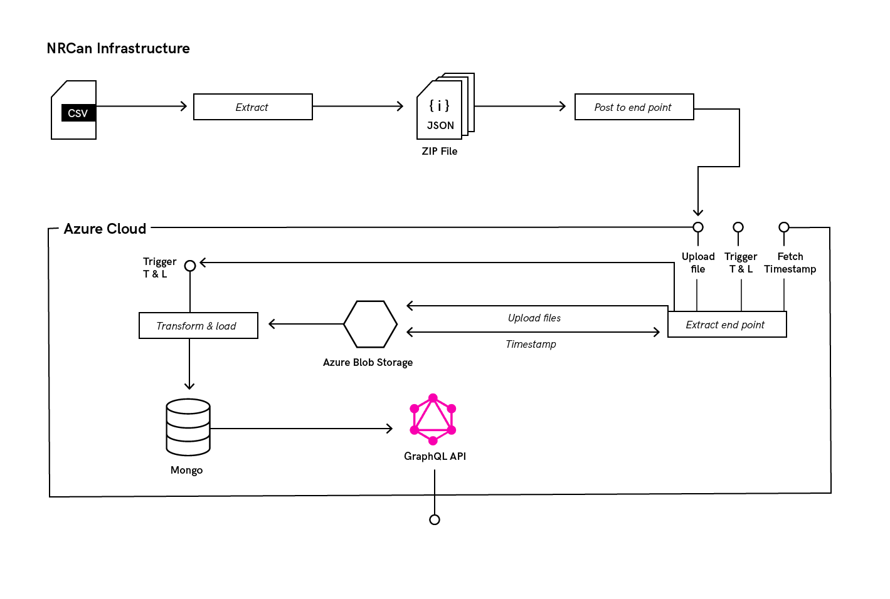

# Ingress to ETL - AKA generating input CSVs

See the following diagram for an architechural overview of the system



To generate the input to the system this describes, a script will have to be written to generate the CSV dumps of the database

The system is built to support incremental loads, and has convience built-in for generating the incremental dumps from the database.
The `Extract endpoint` portion of the system provides three endpoints, one of which is for fetching the timestamp showing how fresh the
data is. This will return the most recent `MODIFICATIONDATE` provided to the system, which is updated along with each post to the endpoint.

The ingress to the system should query this endpoint, and dump all rows with modification date after what is returned by
the `/timestamp` endpoint, and pass along the latest `MODIFICATIONDATE` in the returned dataset.

Something along the lines of the following

```
url="https://nrcan-endpoint.azurewebsites.net"
modification_date=$(curl "$url/timestamp") 
new_date = $(dump_from_datebase.sh $modification_date)
energuide extract --infile generated.csv --outfile extract.zip
extract_endpoint extract.zip $new_date --url $url
```

Where `dump_from_database.sh` is some script that dumps all rows who's `MODIFICATIONDATE` field is after the date passed in, and outputs the max `MODIFICATIONDATE` in the returned data.
